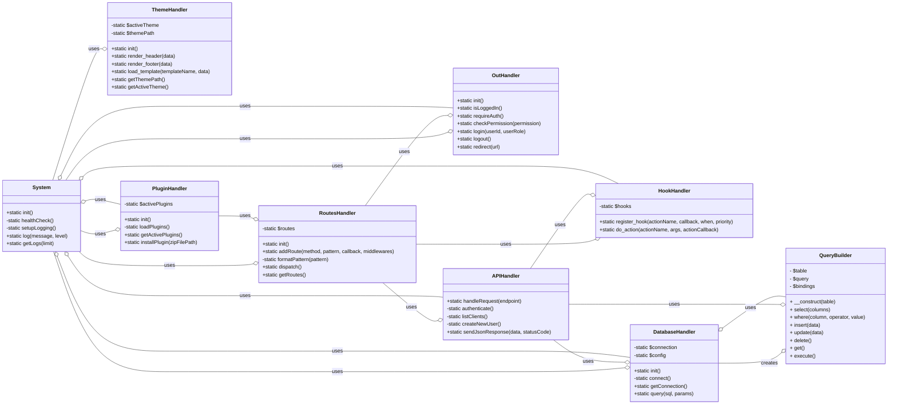

```mermaid
classDiagram
    direction LR
    class System {
        +static init()
        -static healthCheck()
        -static setupLogging()
        +static log(message, level)
        +static getLogs(limit)
    }

    class ThemeHandler {
        -static $activeTheme
        -static $themePath
        +static init()
        +static render_header(data)
        +static render_footer(data)
        +static load_template(templateName, data)
        +static getThemePath()
        +static getActiveTheme()
    }

    class RoutesHandler {
        -static $routes
        +static init()
        +static addRoute(method, pattern, callback, middlewares)
        -static formatPattern(pattern)
        +static dispatch()
        +static getRoutes()
    }

    class HookHandler {
        -static $hooks
        +static register_hook(actionName, callback, when, priority)
        +static do_action(actionName, args, actionCallback)
    }

    class PluginHandler {
        -static $activePlugins
        +static init()
        -static loadPlugins()
        +static getActivePlugins()
        +static installPlugin(zipFilePath)
    }

    class DatabaseHandler {
        -static $connection
        -static $config
        +static init()
        -static connect()
        +static getConnection()
        +static query(sql, params)
    }

    class QueryBuilder {
        - $table
        - $query
        - $bindings
        + __construct(table)
        + select(columns)
        + where(column, operator, value)
        + insert(data)
        + update(data)
        + delete()
        + get()
        + execute()
    }

    class OutHandler {
        +static init()
        +static isLoggedIn()
        +static requireAuth()
        +static checkPermission(permission)
        +static login(userId, userRole)
        +static logout()
        +static redirect(url)
    }

    class APIHandler {
        +static handleRequest(endpoint)
        -static authenticate()
        -static listClients()
        -static createNewUser()
        +static sendJsonResponse(data, statusCode)
    }

    System --o ThemeHandler : uses
    System --o DatabaseHandler : uses
    System --o OutHandler : uses
    System --o PluginHandler : uses
    System --o RoutesHandler : uses

    RoutesHandler --o APIHandler : uses
    RoutesHandler --o OutHandler : uses
    RoutesHandler --o HookHandler : uses

    PluginHandler --o RoutesHandler : uses
    PluginHandler --o System : uses

    DatabaseHandler --o QueryBuilder : creates
    QueryBuilder --o DatabaseHandler : uses
    DatabaseHandler --o System : uses

    OutHandler --o System : uses

    APIHandler --o DatabaseHandler : uses
    APIHandler --o QueryBuilder : uses
    APIHandler --o System : uses
    APIHandler --o HookHandler : uses

    HookHandler --o System : uses


```

